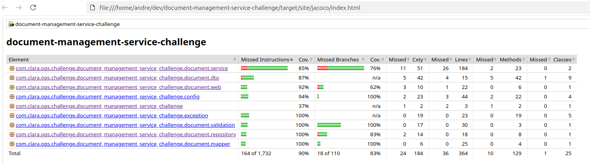

# Document Management Service – Solution Guide

This document explains how to build, run, and validate the document-management-service locally. It covers the application architecture, Docker-based workflow, automated test plan execution with JMeter, and the quality checks that keep the codebase healthy.

## 1. Architecture Overview
- **Application** – Spring Boot 3 service exposing `/document-management` REST endpoints for upload, search, and download workflows.
- **Storage** – MinIO S3-compatible bucket receives binary content; metadata is persisted in PostgreSQL (`document_schema`).
- **Infrastructure** – Docker Compose stack wires the application together with PostgreSQL and MinIO, applying the 50 MB JVM heap cap defined in the Dockerfile.
- **Automation** – JMeter test plan (`jmeter/test-plan.jmx`) simulates end-to-end traffic (presigned upload → PUT file → confirm → search → download) to populate MinIO/PostgreSQL.
- **Observability** – Spring Boot Actuator exposes health, metrics, and Prometheus scrape endpoints; custom `memory` health indicator tracks heap usage.

## 2. Repository Layout
- `src/main/java/...` – Controllers, services, repositories, MinIO adapter, validation, and exception handling.
- `src/main/resources/application.yml` – Environment-driven configuration for datasource, MinIO, and bucket options.
- `docker/` – Docker Compose definitions, MinIO/PostgreSQL init scripts, JMeter stack.
- `jmeter/` – Non-GUI JMeter plan, sample payloads, and output directory (`results/results.jtl`).
- `docs/` – OpenAPI contract (`document-management-open-api.yml`) and detailed MinIO setup notes.

## 3. Prerequisites
- Docker Engine ≥ 24 with the Compose plugin (`docker compose` command) or legacy `docker-compose` binary.
- 6 GB free RAM (JMeter load plus MinIO/PostgreSQL).
- (Optional) JDK 17+ for local development or executing Maven goals without Docker.
- (Optional) `psql` CLI if you plan to inspect the database manually.

### 3.1 Quality & Test Evidence
- Unit/integration tests (`./mvnw clean verify`) produce the JaCoCo coverage report shown in `docs/jacoco_report.png`.
- Reference the rendered chart below to confirm coverage metrics captured during the latest successful run.



## 4. Running the Stack with Docker Compose
1. Ensure no residual containers are bound to the required ports (`8080`, `5432`, `9000`, `9001`).
2. From the repository root, build and start the full stack:
   ```bash
   docker compose -f docker/docker-compose.yml up --build
   ```
   > Use `docker-compose` instead of `docker compose` if you rely on the standalone binary.
3. Wait until the logs print:
   - `Created bucket document-bucket` from the application.
   - `INFO ... Started DocumentManagementServiceChallengeApplication` indicating Spring Boot is ready.
4. When you are done, stop everything with `Ctrl+C`; add `-d` to run detached and later tear down with `docker compose -f docker/docker-compose.yml down`.
5. To completely remove containers **and** persistent volumes, run:
   ```bash
   docker compose -f docker/docker-compose.yml down -v
   ```

### 4.1 Services & Ports
- `document_management_service` – REST API on `http://localhost:8080`.
- `postgresql_container` – PostgreSQL 15.4 on `localhost:5432` (`postgres` / `postgres`, database `challenge`, schema `document_schema`).
- `minio` – S3 API on `http://localhost:9000` and console on `http://localhost:9001` (`minioadmin` / `minioadmin`).
- Named volumes `challenge_postgresql_data` and `challenge_minio_data` hold state across restarts.
- If you run on Linux, ensure your host resolves `host.docker.internal` so presigned URLs work from the browser/CLI. Add the line below to `/etc/hosts` (or the equivalent host file) before testing downloads:
  ```
  127.0.0.1 host.docker.internal
  ```

### 4.2 Customising Configuration
Override defaults via environment variables before launching compose (or edit `docker/docker-compose.yml`):
- `SPRING_DATASOURCE_URL`, `SPRING_DATASOURCE_USERNAME`, `SPRING_DATASOURCE_PASSWORD`.
- `MINIO_ENDPOINT`, `MINIO_ACCESS_KEY`, `MINIO_SECRET_KEY`, `MINIO_SECURE` (set to `true` for HTTPS endpoints).
- `DOCUMENT_STORAGE_BUCKET`, `DOCUMENT_STORAGE_PREFIX`, `DOCUMENT_STORAGE_PRESIGNED_EXPIRY_SECONDS`, `DOCUMENT_STORAGE_DOWNLOAD_URL_BASE`.

## 5. Smoke Test the API Manually
With the stack running:

1. **Health & Metrics**
   ```bash
   curl http://localhost:8080/actuator/health
   curl http://localhost:8080/actuator/metrics/jvm.memory.used
   ```
2. **Request a presigned PUT URL**
   ```bash
   curl -s -X POST http://localhost:8080/document-management/documents/uploads \
     -H 'Content-Type: application/json' \
     -d '{"user":"alice","fileName":"tax-report","tags":["finance"],"fileSize":12345}'
   ```
   The response contains `{ "url": "https://..." }` – copy the URL.
3. **Upload a PDF to MinIO using the presigned URL**
   ```bash
   curl -X PUT "<upload-url-from-step-2>" \
     -H 'Content-Type: application/pdf' \
     --data-binary @jmeter/sample-file.pdf
   ```
4. **Confirm the upload so metadata is stored**
   ```bash
   curl -s -X POST http://localhost:8080/document-management/documents \
     -H 'Content-Type: application/json' \
     -d '{
           "user":"alice",
           "fileName":"tax-report.pdf",
           "tags":["finance"],
           "objectKey":"document-bucket/alice/<uuid>-tax-report.pdf",
           "fileSize":12345,
           "contentType":"application/pdf"
         }'
   ```
   Use the path segment from the PUT URL as `objectKey`. The response returns the canonical document metadata (ID, timestamps).
5. **Search**
   ```bash
   curl -s -X POST http://localhost:8080/document-management/documents/search \
     -H 'Content-Type: application/json' \
     -d '{"user":"alice"}'
   ```
6. **Generate a download URL**
   ```bash
   curl -s http://localhost:8080/document-management/documents/<document-id>/download
   ```
   Fetching the returned URL downloads the stored PDF via MinIO.

## 6. Populate Data with JMeter
The provided non-GUI plan spawns 50 concurrent users driving the full upload/search/download flow. **Start the Docker Compose stack from section 4 (application, PostgreSQL, MinIO) and wait until the Spring Boot service is ready before launching JMeter.**

1. Remove any stale container (optional but avoids name clashes):
   ```bash
   docker rm jmeter 2>/dev/null || true
   ```
2. Launch the JMeter stack on the same Docker network:
   ```bash
   docker compose -p jmeter -f docker/jmeter-compose.yml up
   ```
   - The compose file reuses the external `batch_network` created by the main stack.
   - Logs show progress (`Starting JMeter...` and per-request summaries).
3. Results are persisted to `jmeter/results/results.jtl`. Inspect with:
   ```bash
   tail -f jmeter/results/results.jtl
   ```
4. When complete, stop the run with `Ctrl+C` (or add `-d` and later stop via `docker compose -p jmeter -f docker/jmeter-compose.yml down`).

### 6.1 Checking the Database After JMeter
```bash
docker exec -it postgresql_container psql -U postgres -d challenge \
  -c "SELECT id, owner, name, file_size, created_at FROM document_schema.documents ORDER BY created_at DESC LIMIT 5;"
```
MinIO’s web console (`http://localhost:9001`) will display the uploaded objects inside `document-bucket`.

## 7. Local Development Workflow
1. Start backing services only:
   ```bash
   docker compose -f docker/docker-compose.yml up -d postgresql minio
   ```
2. Export the same environment variables locally (or rely on defaults pointing to `localhost`).
3. Run the Spring Boot app on your host machine:
   ```bash
   ./mvnw spring-boot:run
   ```
4. Hot reload is supported via Spring DevTools (enabled on the classpath during local runs).

### 7.1 Useful Maven Commands
- `./mvnw clean verify` – compiles, executes unit/integration tests, generates JaCoCo coverage (`target/site/jacoco/index.html`). Requires Docker because Testcontainers spins up PostgreSQL.
- `./mvnw clean verify -DskipITs` – skips Testcontainers integration tests when Docker is unavailable.
- `./mvnw spotless:check` / `./mvnw spotless:apply` – enforce Google Java Format and Markdown style.
- `./mvnw dependency:analyze` – review unused/missing dependencies (non-fatal by default).

## 8. API Surface Summary
- `POST /document-management/documents/uploads` – returns presigned PUT URL for client uploads (validates user, filename, size).
- `POST /document-management/documents` – persists metadata once the client PUTs the file to MinIO.
- `POST /document-management/documents/search` – paginated search by user/name/tags; defaults to newest-first sorting.
- `GET /document-management/documents/{id}/download` – returns presigned GET URL (optionally rewritten via `DOCUMENT_STORAGE_DOWNLOAD_URL_BASE`).
- Errors return `ApiErrorResponse` with HTTP status, message, timestamp, and request path. Validation is centralised in `GlobalExceptionHandler`.

Refer to `docs/document-management-open-api.yml` for full request/response schemas.

## 9. Observability & Ops
- `GET /actuator/health` – includes a `memory` component that fails when heap usage passes `management.health.memory.threshold` (50 MB by default).
- `GET /actuator/metrics/*` – Micrometer-based metrics; Prometheus scrape endpoint at `/actuator/prometheus`.
- Application logs (structured via SLF4J) record key operations: presigned URL generation, upload retries, MinIO bucket creation, service-layer events.

## 10. Troubleshooting
- **Service fails to reach MinIO** – ensure `MINIO_ENDPOINT` is reachable from inside the container. The compose file injects `host.docker.internal`, but on Linux ensure Docker Engine ≥ 20.10 with gateway mapping support.
- **`DocumentManagementServiceChallengeApplicationTests` error about `com.sun.jna.Native`** – Testcontainers needs permission to load native libraries. Install `libjna` on the host or run Maven with `-DskipITs` if Docker/JNA isn’t available.
- **Port conflicts** – adjust the published ports in `docker/docker-compose.yml` or stop the competing service.
- **Residual state from previous runs** – remove named volumes with `docker volume rm challenge_postgresql_data challenge_minio_data` (all data will be lost) or wipe MinIO objects via the console.
- **JMeter cannot resolve host** – confirm the main stack is running and the shared `batch_network` exists (`docker network ls | grep batch_network`). Recreate the network with `docker network create batch_network` if needed.

## 11. Next Steps & Validation Checklist
- [ ] Stack started with `docker compose -f docker/docker-compose.yml up --build`.
- [ ] Health endpoint returns `UP` and metrics respond.
- [ ] Manual upload + confirm flow succeeds.
- [ ] JMeter plan produces entries in PostgreSQL and objects in MinIO.
- [ ] `./mvnw clean verify` (or `-DskipITs`) passes and JaCoCo report inspected.
- [ ] Spotless formatting check is clean.

Once each box is checked you have a fully functioning document-management-service instance with reproducible load and validation tooling.
